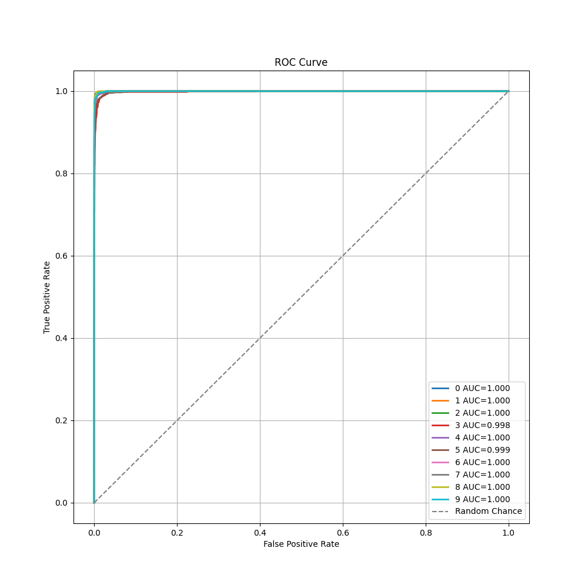

# Vision Transformer
This is a re-reimplementation of Jeonsworld's [PyTorch implementation of the ViT](https://github.com/jeonsworld/ViT-pytorch), which is almost 5 years old at this point. This implementation seeks to overhaul the PyTorch implementation by re-implementing the code in PyTorch Lightning to reduce boilerplate code, and facilitate compatibility with logging tools such as Tensorboard. Additionally, some bugs are fixed from the previous repo's implementation, such as replacing Apex's AMP and DDP strategies with torch.cuda's own stable implementations.

The updated files can be found in `models/modeling_pl.py` and `data_utils_pl.py`, alongside the new `main.py` file which implements the Lightning framework.

Pytorch reimplementation of [Google's repository for the ViT model](https://github.com/google-research/vision_transformer) that was released with the paper [An Image is Worth 16x16 Words: Transformers for Image Recognition at Scale](https://arxiv.org/abs/2010.11929) by Alexey Dosovitskiy, Lucas Beyer, Alexander Kolesnikov, Dirk Weissenborn, Xiaohua Zhai, Thomas Unterthiner, Mostafa Dehghani, Matthias Minderer, Georg Heigold, Sylvain Gelly, Jakob Uszkoreit, Neil Houlsby.

This paper show that Transformers applied directly to image patches and pre-trained on large datasets work really well on image recognition task.


## Usage
### 1. Download Pre-trained model (Google's Official Checkpoint)
* [Available models](https://console.cloud.google.com/storage/vit_models/): ViT-B_16(**85.8M**), R50+ViT-B_16(**97.96M**), ViT-B_32(**87.5M**), ViT-L_16(**303.4M**), ViT-L_32(**305.5M**), ViT-H_14(**630.8M**)
  * imagenet21k pre-train models
    * ViT-B_16, ViT-B_32, ViT-L_16, ViT-L_32, ViT-H_14
  * imagenet21k pre-train + imagenet2012 fine-tuned models
    * ViT-B_16-224, ViT-B_16, ViT-B_32, ViT-L_16-224, ViT-L_16, ViT-L_32
  * Hybrid Model([Resnet50](https://github.com/google-research/big_transfer) + Transformer)
    * R50-ViT-B_16
```
# imagenet21k pre-train
wget https://storage.googleapis.com/vit_models/imagenet21k/{MODEL_NAME}.npz

# imagenet21k pre-train + imagenet2012 fine-tuning
wget https://storage.googleapis.com/vit_models/imagenet21k+imagenet2012/{MODEL_NAME}.npz

```

Breaking down the naming convention:
- R50 → Stands for ResNet50. If the name starts with "R50" then it refers to a hybrid variant combining both ResNet and ViT in one.
- ViT → Stands for Vision Transformer
- B → Refers to the "Base" variant of ViT. ViT models come in different sizes:
  - ViT-B: Base model (~86M parameters)
  - ViT-L: Large model (~307M parameters)
  - ViT-H: Huge model (~632M parameters)
- 16, 32 → Represents the patch size (16×16, or 32×32 pixels).
  - In ViT, an image is split into fixed-size patches, which are then flattened and fed into the Transformer.
  - A patch size of 32 means that each image is divided into non-overlapping 32×32 pixel patches before being processed.

### 2. Setting up the virtual environment

```
$ python3 -m venv env
$ source env/bin/activate
(env) $ pip install -r requirements.txt
```

### 3. Train Model
```
(env) $ python3 main.py --mode train --expt experiments/hymenoptera_pretrain_ViT-B_16.json
```

The Hymenoptera dataset can be downloaded at the following [link]()https://www.kaggle.com/datasets/thedatasith/hymenoptera/code

The default batch size is 8 due to limitations on my personal machine, however on the original repository, the batch size is set to 512 by default.

### 4. Evaluate Model
```
(env) $ python3 main.py --mode eval --expt experiments/hymenoptera_pretrain_iT-B_16.json --ckpt_path checkpoint/your_model.ckpt
```

## Results
The model was trained and evaluated on the Hymenoptera dataset for the binary classification of ants and bees. Training was conducted for a total of 25 epochs with a batch size of 8 per experiment. All experiments were performed on an NVIDIA GeForce GTX 1650 GPU with 4GB of VRAM. Optimization was carried out using Stochastic Gradient Descent (SGD) with a learning rate of $3 \cdot 10^{-2}$, employing a WarmupCosine learning rate scheduler. Detailed specifications and configurations for each experiment are documented in the `experiment/` directory., with WarmupCosine scheduler.

The "Pretrain" column in this table refers to if this model was instantiated with the imagenet21k pre-train + imagenet2012 fine-tuning weights.

|    Model     |  Pretrain   | Patch Size | Resolution |   ↑ Accuracy  |    F1-score    |    AUC    |  time   |
|:------------:|:-----------:|:----------:|:----------:|:-------------:|:--------------:|:---------:|:-------:|
|   ViT-B_16   | Yes         |   16x16    |  224x224   |    0.9673     |     0.9650     |   0.9945  |    9m   |
|   ViT-B_32   | Yes         |   32x32    |  224x224   |    0.9608     |     0.9571     |   0.9927  |    2m   |
| R50-ViT-B_16 | Yes         |   16x16    |  224x224   |    0.9542     |     0.9503     |   0.9800  |   11m   |
|   ViT-B_16   | No          |   16x16    |  224x224   |    0.7124     |     0.7179     |   0.7687  |    8m   |
|   ViT-B_32   | No          |   32x32    |  224x224   |    0.6993     |     0.7088     |   0.7989  |    2m   |
| R50-ViT-B_16 | No          |   16x16    |  224x224   |    0.5424     |      0.0       |   0.5353  |   11m   |


### Pretrained VIT-B_16 ROC



### Pretrained ViT-B_16 Confusion Matrix


## References
* [Original ViT-PyTorch repo](https://github.com/jeonsworld/ViT-pytorch)
* [Google ViT](https://github.com/google-research/vision_transformer)
* [Pytorch Image Models(timm)](https://github.com/rwightman/pytorch-image-models)
